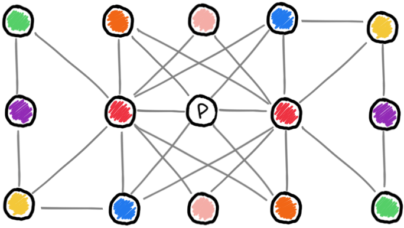

<p align="center">
   
   <br>

   <h1 align="center">magnet</h1>

   <h3 align="center"><a href="https://prismadic.github.io/magnet/">📖 docs</a> | 💻 <a href="https://github.com/Prismadic/magnet/tree/main/examples">examples</a> | 📓 <a href="https://prismadic.substack.com">substack</a></h3> 

   <p align="center">the small distributed language model toolkit</p>
   <p align="center"><i>⚡️ fine-tune state-of-the-art LLMs anywhere, rapidly ⚡️</i></p>
   <div align="center">
</p>


   </div>

</p>


## 🧬 Installation

``` bash
pip install llm-magnet
```

or

``` bash
python3 setup.py install
```


## 🎉 usage

[check out the example notebooks](./examples/)

<small>a snippet to get you started</small>

``` python
from magnet.ize.filings import Processor
source_data_file = "./raw/filings.csv"
export_data_file = "./data/filings_mistral_nlp.parquet"
filings = Processor()
filings.load(
    source_data_file
    , 'clean'
    , 'file'
)
await filings.process(
    export_data_file
    , nlp=True
)
```


## 🔮 features

<center>

</center>

- ⚡️ **It's Fast**
  - <small>fast on consumer hardware</small>
  - <small>_very_ fast on Apple Silicon</small>
  - <small>**extremely** fast on ROCm/CUDA</small>
- 🫵 **Automatic or your way**
  - <small>rely on established transformer patterns to let `magnet` do the work</small>
  - <small>keep your existing data processing functions, bring them to `magnet`!</small>
- 🛰️ **100% Distributed**
  - <small>processing, embedding, storage, retrieval, querying, or inference from anywhere</small>
  - <small>as much or as little compute as you need</small>
- 🧮 **Choose Inference Method**
  - <small>HuggingFace</small>
  - <small>vLLM node</small>
  - <small>GPU</small>
  - <small>mlx</small>
- 🌎 **Huge Volumes**
  - <small>handle gigantic amounts of data inexpensively</small>
  - <small>fault-tolerant by design</small>
  - <small>decentralized workloads</small>
- 🔐 **Secure**
  - <small>JWT</small>
  - <small>Basic</small>
- 🪵 **World-Class Comprehension**
  - <small>`magnet` optionally logs its own code as it's executed (yes, really)</small>
  - <small>build a self-aware system and allow it to learn from itself</small>
  - <small>emojis are the future</small>


## 🧲 why

- build a distributed LLM research node with any hardware, from Rasbperry Pi to the expensive cloud
- Apple silicon first-class citizen with [mlx](https://github.com/ml-explore/mlx)
- embed & index to vector db with [milvus](https://milvus.io)
- distributed processing with [NATS](https://nats.io)
- upload to S3
- ideal cyberpunk vision of LLM power users in vectorspace


